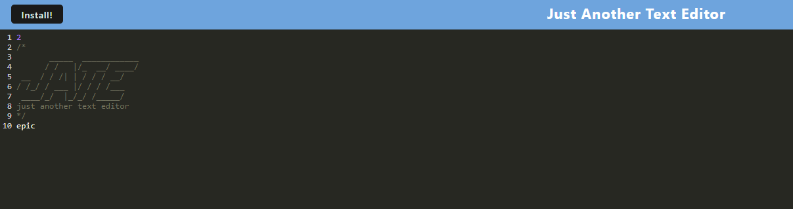

 
# A Text Editor in the Browser

## Description

I created this project to practice with wepack configuration, and service workers. With these two aplacations I was able to implament asset cashing so the aplaction can be partily used offline and to create an installable aplacation. Durring this project I learned how to properly configure a webpack file to produce the results I wanted, and how to cash data using a service worker.

## Table of Contents (Optional)

- [Installation](#installation)
- [Usage](#usage)
- [Credits](#credits)
- [License](#license)

## Installation

To run this aplacation please run an npm install on the main package.json file.

## Usage
To use this project run a npm run on local host or visit the heroku aplacation here :https://notepadsreplacement-89f6795fcad3.herokuapp.com/. once there you can install the program to your browser by hitting the intall button in the top left.

;

## License

Copyright 2023, 

    Permission is hereby granted, free of charge, to any person obtaining a copy of this software and associated documentation files (the “Software”), to deal in the Software without 
    restriction, including without limitation the rights to use, copy, modify, merge, publish, distribute, sublicense, and/or sell copies of the Software, and to permit persons to whom 
    the Software is furnished to do so,subject to the following conditions:
    The above copyright notice and this permission notice shall be included in all copies or substantial portions of the Software.
    THE SOFTWARE IS PROVIDED “AS IS”, WITHOUT WARRANTY OF ANY KIND, EXPRESS OR IMPLIED, INCLUDING BUT NOT LIMITED TO THE WARRANTIES OF MERCHANTABILITY, FITNESS FOR A PARTICULAR PURPOSE 
    AND NONINFRINGEMENT. IN NO EVENT SHALL THE AUTHORS OR COPYRIGHT HOLDERS BE LIABLE FOR ANY CLAIM, DAMAGES OR OTHER LIABILITY, WHETHER IN AN ACTION OF CONTRACT, TORT OR OTHERWISE, 
    ARISING FROM, OUT OF OR IN CONNECTION WITH THE SOFTWARE OR THE USE OR OTHER DEALINGS IN THE SOFTWARE.
(https://opensource.org/licenses/MIT)
